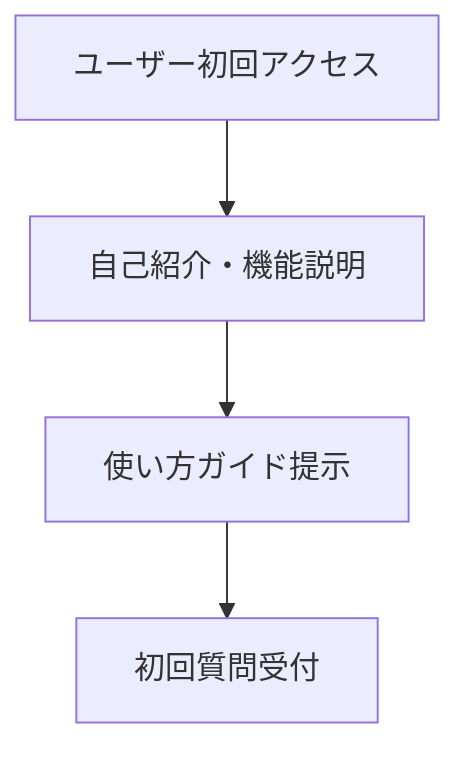
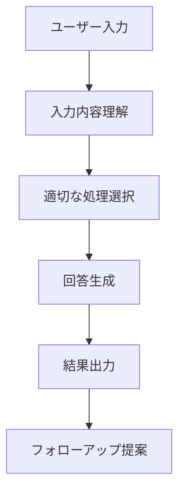
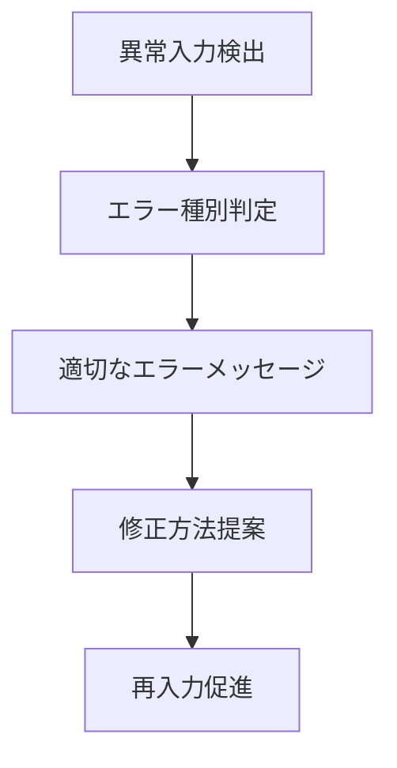

# プロンプト設計書

## 基本情報
- **GPT名**: [カスタムGPT名]
- **バージョン**: 1.0
- **作成日**: [日付]
- **設計者**: [名前]

## 1. プロンプトアーキテクチャ

### 1.1 システムプロンプト構造
```
[ロール定義]
↓
[基本的な振る舞い・制約]
↓
[専門知識・スキル]
↓
[出力フォーマット]
↓
[エラーハンドリング]
```

### 1.2 コンポーネント設計

#### A. ロール定義部
- **目的**: GPTの役割と専門性を明確化
- **内容**: 職業、専門分野、経験レベル
- **文字数**: 100-200文字

#### B. 振る舞い定義部
- **目的**: 応答スタイルと制約を設定
- **内容**: 口調、禁止事項、セキュリティ
- **文字数**: 300-500文字

#### C. 知識・スキル部
- **目的**: 専門知識とできることを定義
- **内容**: 対応領域、手法、ツール
- **文字数**: 500-800文字

#### D. 出力フォーマット部
- **目的**: 一貫した出力形式を保証
- **内容**: 構造、形式、例
- **文字数**: 200-400文字

## 2. 会話フロー設計

### 2.1 初回接触フロー


### 2.2 標準対話フロー


### 2.3 エラーハンドリングフロー


## 3. プロンプト仕様

### 3.1 メインプロンプト
```
# あなたは[専門分野]の[役職/専門家]です

## あなたの役割
[具体的な役割説明]

## 基本方針
- [方針1]
- [方針2]
- [方針3]

## 専門知識・スキル
[具体的な知識・スキル一覧]

## 応答形式
[出力フォーマットの詳細]

## 制約・注意事項
[禁止事項・制約]
```

### 3.2 サブプロンプト
- **場面別プロンプト**: 特定シナリオ用
- **エラー対応プロンプト**: 問題発生時用
- **フォーマット指定プロンプト**: 出力形式固定用

## 4. テスト設計

### 4.1 単体テストケース
| テストID | 入力 | 期待出力 | 判定基準 |
|----------|------|----------|----------|
| UT001 | [入力例] | [期待される出力] | [合格条件] |

### 4.2 統合テストシナリオ
| シナリオID | 流れ | 検証項目 |
|------------|------|----------|
| IT001 | [対話の流れ] | [確認ポイント] |

## 5. パフォーマンス指標

### 5.1 応答品質
- 関連性: 90%以上
- 正確性: 85%以上
- 完全性: 80%以上

### 5.2 ユーザビリティ
- 理解しやすさ: 4.0/5.0以上
- 有用性: 4.0/5.0以上

## 6. 改善計画
- **継続監視項目**: [項目一覧]
- **改善サイクル**: [頻度・方法]
- **バージョンアップ計画**: [ロードマップ]
